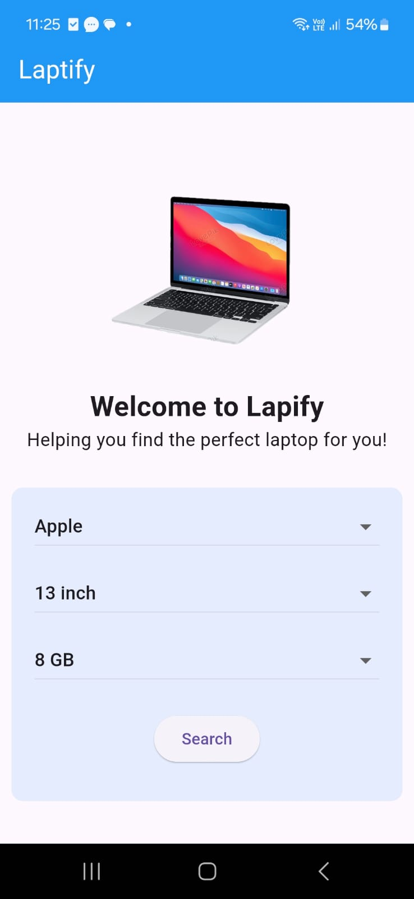
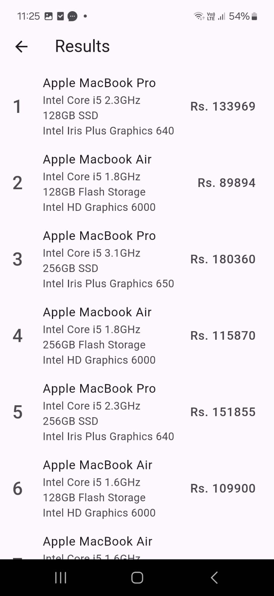

# Lapify Project

Lapify is a comprehensive application designed to provide detailed information about various laptop models. Developed using Flutter.

## Table of Contents

- [Project Overview](#project-overview)
- [Features](#features)
- [Screenshots](#screenshots)
- [Getting Started](#getting-started)
  - [Prerequisites](#prerequisites)
  - [Installation](#installation)
- [License](#license)

## Project Overview

Lapify is ideal for users looking to compare and research laptops based on specific criteria. Whether you are a tech enthusiast, a student, or a professional looking to purchase a new laptop, Lapify offers an organized and accessible database to help you make informed decisions. By providing detailed specifications and allowing for easy comparison, Lapify simplifies the process of finding the perfect laptop to meet your needs.

## Features

- Cross-platform compatibility (Android, iOS and web)
- Comprehensive database schema for storing laptop information
- Consistent and engaging user experience across all platforms

## Screenshots

Here are some screenshots of the Lapify application:

### Home Screen



### Laptop Details



## Getting Started

### Prerequisites

- Flutter SDK: [Installation Guide](https://flutter.dev/docs/get-started/install)
- Dart SDK (included with Flutter)
- A code editor (e.g., Visual Studio Code, Android Studio)

### Installation

1. Clone the repository
   ```sh
   git clone  https://github.com/chetanr250/lapify.git
   ```

## License

This project is licensed under the MIT License - see the [LICENSE](LICENSE) file for details.
